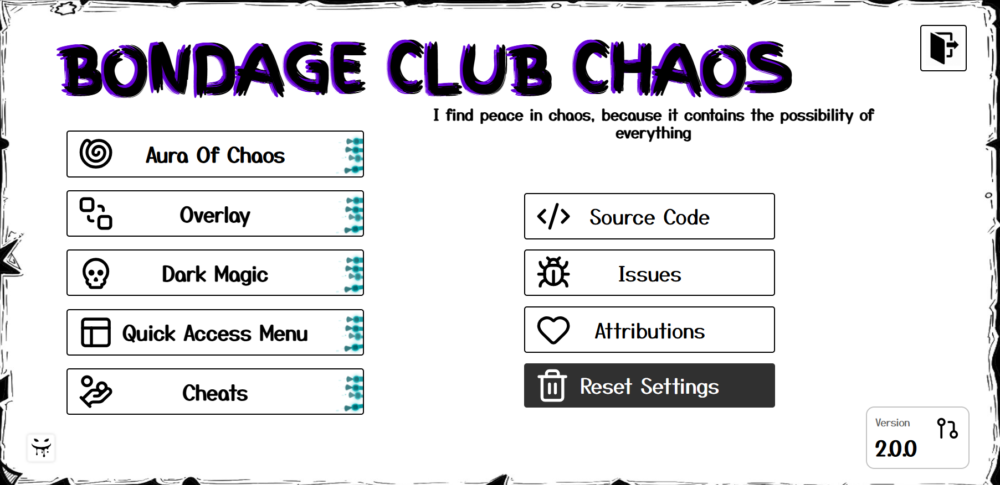

# <b>Bondage Club Chaos</b>

Cheat addon with quality of life features, own activities and magical mechanics. (Remake of legacy BCC)
 
The documentation on magic mechanics is in the addon on the `Dark Magic` page. Just like all other functions, everything (almost) is described in the addon.
> ⚠️ This mod is OP in many aspects, so if you don't like it, please leave this page.
# Installation
### Tampermonkey
https://github.com/FurryZoi/Bondage-Club-Chaos/raw/main/bcc.user.js
### Bookmark
https://github.com/FurryZoi/Bondage-Club-Chaos/raw/main/bcc.bookmark.js
# Countering scripts abuse
Now most functions will not work with players who added you to the blacklist, even if `allowed interactions` are not needed for these functions. This means that it will be impossible to copy the outfit code or view the decks of cards and so on if you are added to the target character's blacklist.

# FAQ
### __Will this addon be added to FUSAM?__
Never. This addon has no place in FUSAM and I don't want users to install the addon by accidentally clicking on all the buttons in the FUSAM menu. This addon is intended for a narrow range of users.
### __Why did addon's repository became public?__
- I decided to change the git provider and create a repository on github, where it's not that easy to make the repository private.
- The entire architecture of the mod was changed and the code is now being bundled. This means that the source code would be hidden if the repository was private, what I cannot allow.
- Privacy has little or no benefit.
- I'm tired of the constant questions and requests to share the userscript, and in such situations it's hard for me to come up with an answer.
### __Why the ability to create spells that manipulated the size of characters was removed?__
I will no longer be working on features that manipulate character sizes due to the high risks and issues with ageplay.
### I don't want the addon to make a lot of noise and stand out in the community. For any questions, suggestions or errors, please **open issue** or **contact with me** in discord `neko_ziro`.

# Credits
- **Kitnyx2 font** - KitTheCat
- **Game-Icons** - [game-icons.net](https://game-icons.net)
- **Lucide Icons** - [lucide.dev](https://lucide.dev)

